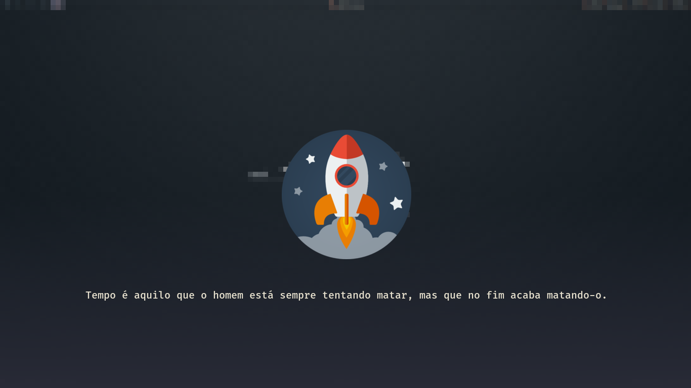

Repositório dedicado aos meus arquivos de configuração do meu ambiente Desktop, com o objetivo de backup e compartilhamento.

# Screenshot

# i3lock

## Descrição:

| Tipos               | Programas                                                                                                                           |
| :------------------ | :---------------------------------------------------------------------------------------------------------------------------------- |
| Linux Distro        | [Arch Linux](https://aur.archlinux.org/)                                                                                            |                                                                                       
| Gerenc. de Janelas  | [i3-gaps](https://github.com/Airblader/i3)                                                                                          |                                                                                             
| Navegador           | [qutebrowser](https://www.mozilla.org/pt-BR/firefox/new/)                                                                           |
| Iniciador Programas | [Rofi](https://github.com/DaveDavenport/rofi)                                                                                       |
| Barra de Status     | [Polybar](https://github.com/jaagr/polybar)                                                                                         |
| Player de Música    | [Ncmpcpp](https://rybczak.net/ncmpcpp/) + [Mpd](https://github.com/MusicPlayerDaemon/MPD)                                           |
| Vídeo Player        | [SMPlayer](https://www.smplayer.info/) e [MPV](https://mpv.io/)                                                                   |
| Visualizador de Som | [Cava](https://github.com/karlstav/cava)                                                                                            |
| Geren. de Arquivos  | [Ranger](https://github.com/ranger/ranger) com [Ícones](https://github.com/alexanderjeurissen/ranger_devicons)                      |
| Visualizador Imagens| [Feh](http://feh.finalrewind.org/)                                                                                                  |                                                                                          
| Gravador de Tela    | [Maim](https://github.com/naelstrof/maim)                                                                                           |
| Emulador Terminal   | [Termite](https://github.com/thestinger/termite)                                                                                    |
| Shell               | [Bash](https://devdocs.io/bash/)                                                                                                   |
| Editor de Texto     | [Nano](https://www.nano-editor.org/) e [VScode](https://code.visualstudio.com/)                                                     |
| Conf. do Monitor    | [Xrandr](https://wiki.archlinux.org/index.php/xrandr)                                                                               |
| Tela de Bloqueio    | [i3lock](https://i3wm.org/i3lock/)                                                                                                  |
| Daemon Notificação  | [Dunst](https://github.com/dunst-project/dunst)                                                                                     |
| Tema GTK            | [Arc-Theme](https://github.com/horst3180/arc-theme)                                                                                 |
| Tema Cursor         | Breeze Obsidian                                                                                                                     |
